# Trader Joe's Retail Database & POS System

A fully normalized 31-table MySQL database and Bash CLI application simulating a complete retail supply chain. It features ACID-compliant checkouts, recursive categories, and complex SQL analytics for multiple user roles.

### Live Demo

---
### ER Diagram
Detailed ER Diagram
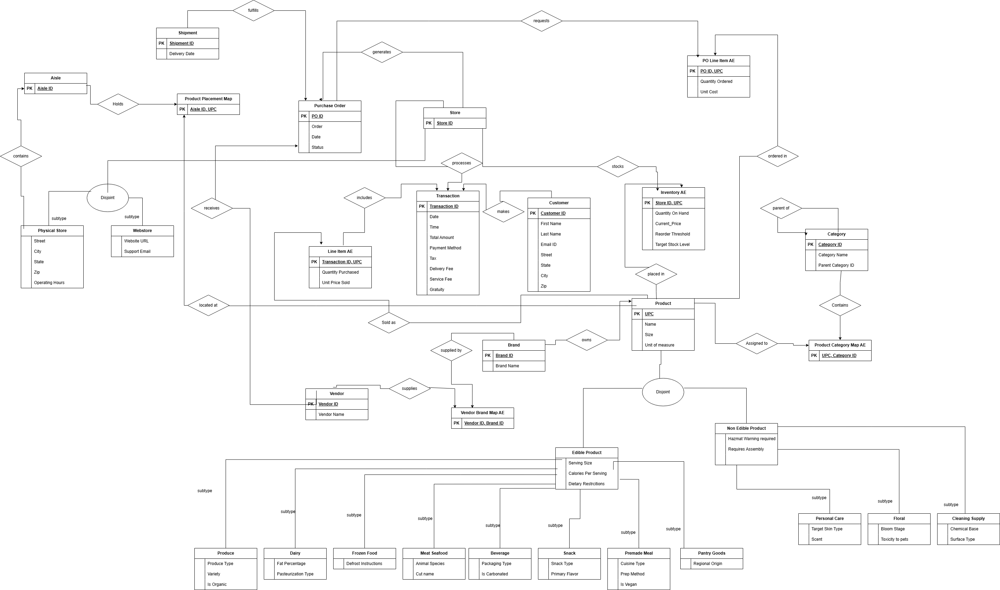

## System Walkthrough 

### Main Menu
The entry point featuring role-based authentication and routing.
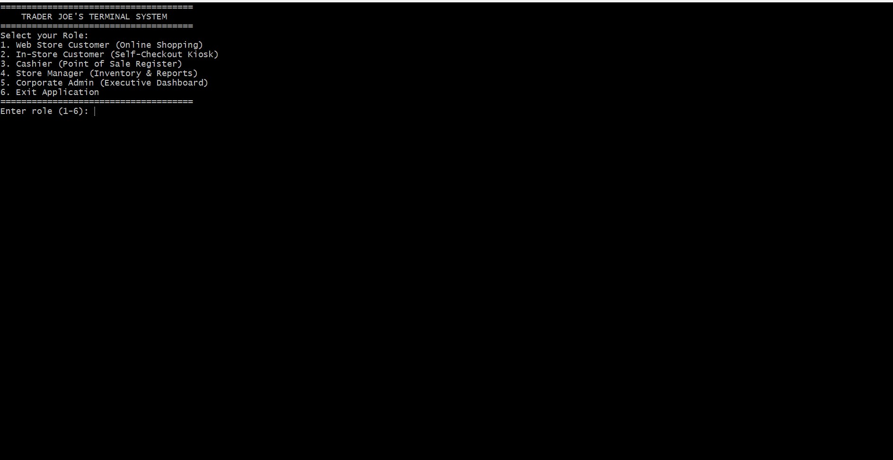

### 1. Customer & Checkout Experience (Web & Kiosk)
Handles active shopping carts, dynamic stock validation, and secure payment processing with historical price-locking.
* **Browsing the Webstore:**
  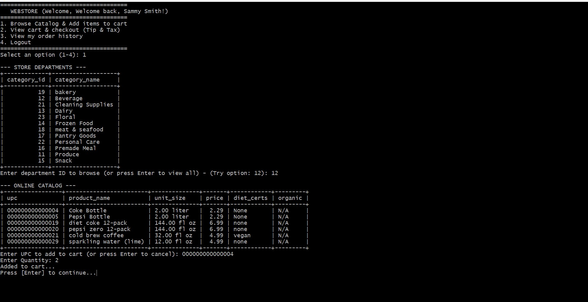
* **Checkout & Payment:**
  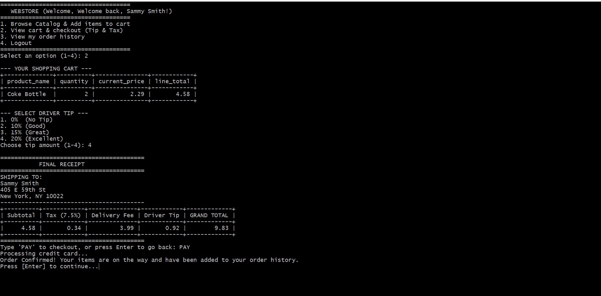
* **Customer Order History:**
  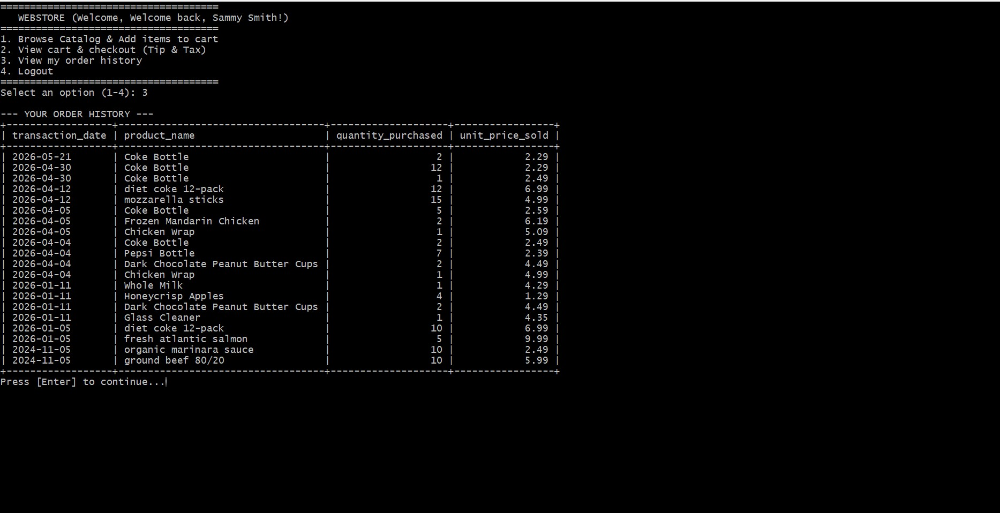

### 2. Store Manager Dashboard
Handles local store logistics, automated reordering, and supply chain tracking.
* **Low Inventory Alerts:**
  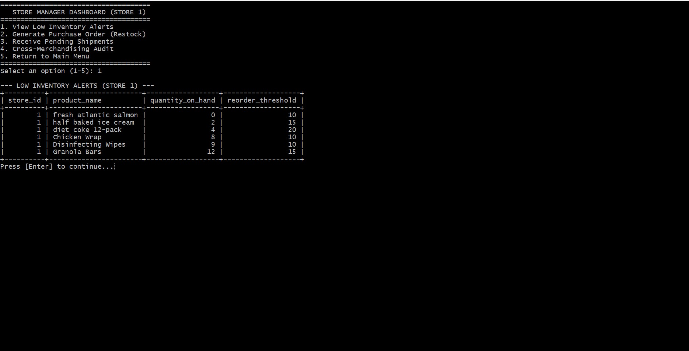
* **Generating Purchase Orders:**
  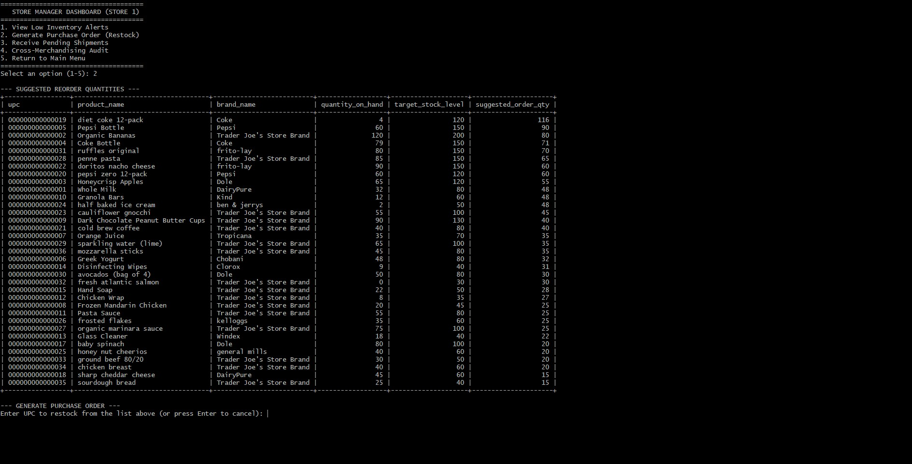
* **Receiving Pending Shipments:**
  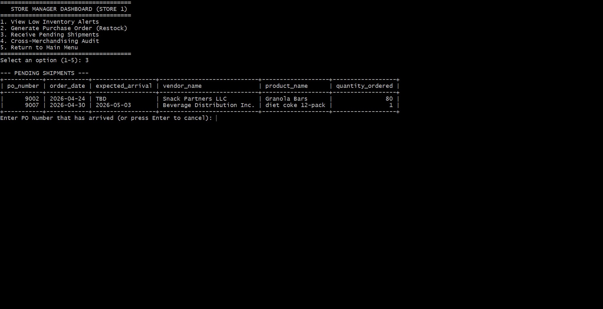
* **Cross-Merchandising Audit (Items in multiple aisles):**
  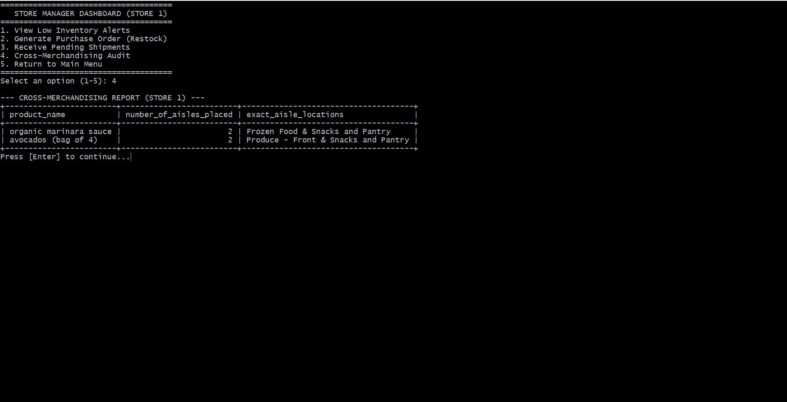

### 3. Corporate Executive Analytics
Executes complex SQL aggregations, self-joins, and hierarchical rollups to drive business decisions.
* **Top Selling Products Overall:**
  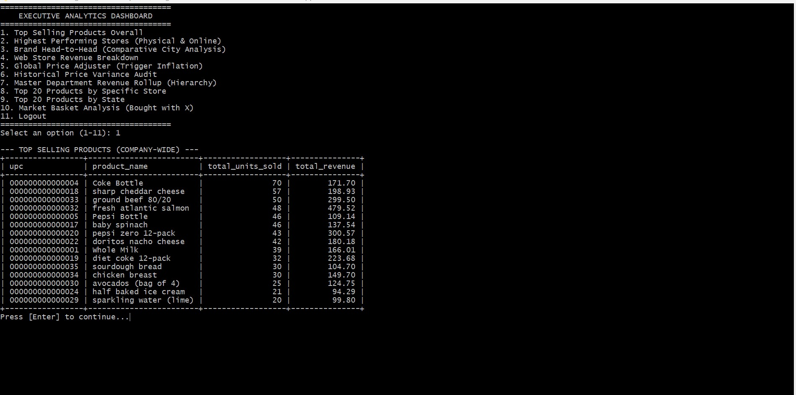
* **Highest Performing Stores:**
  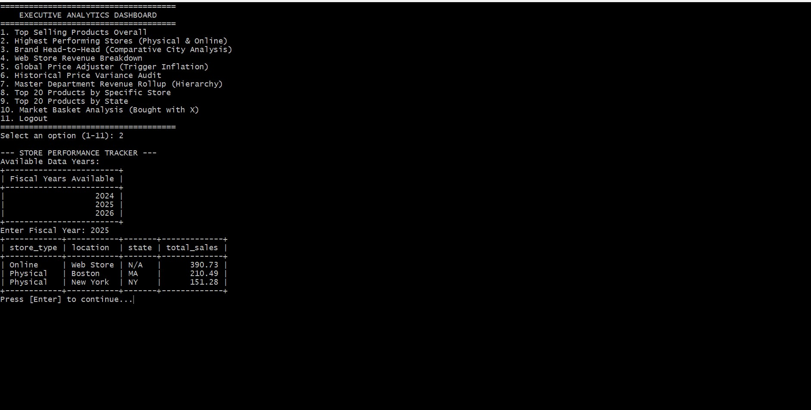
* **Brand Head-to-Head (e.g. Coke vs. Pepsi):**
  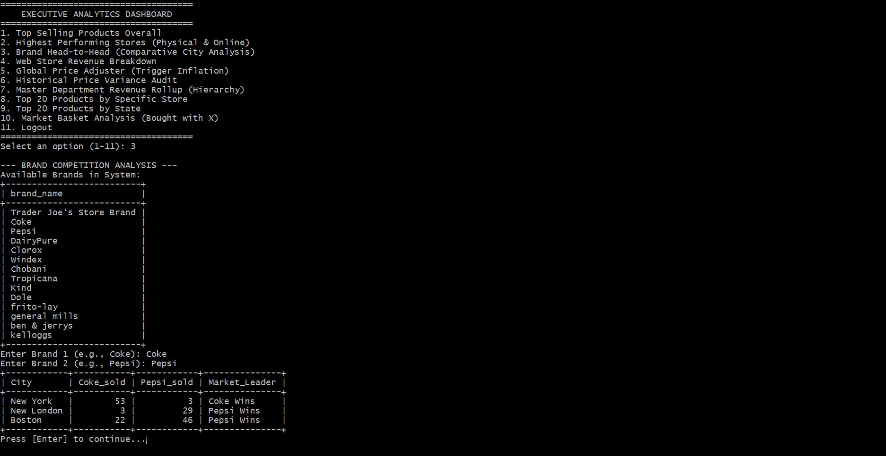
* **Market Basket Analysis (Items bought together):**
  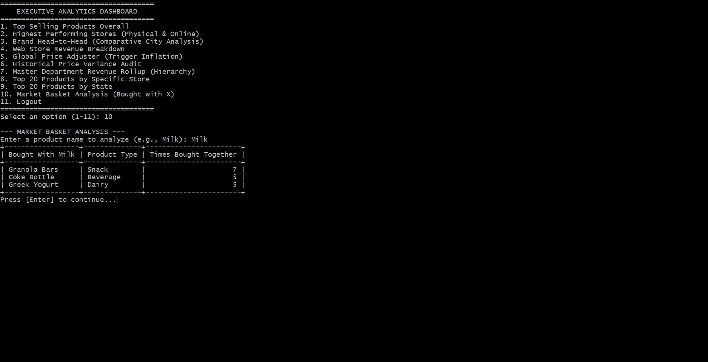
* **Top Products by State / Store:**
  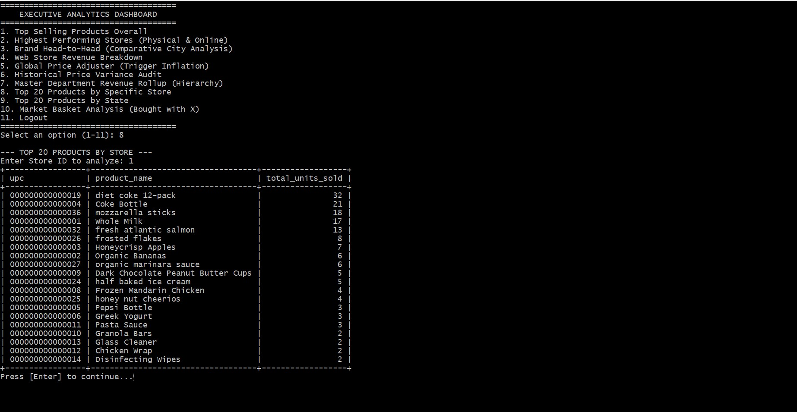
* **Historical Price Variance Audit:**
  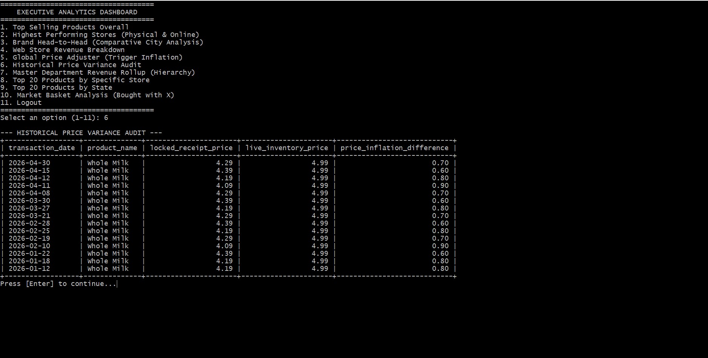

---

## How to Run Locally

**1. Clone the repository:**

git clone [https://github.com/yourusername/trader-joes-pos-system.git](https://github.com/yourusername/trader-joes-pos-system.git)

2. Import the database:

mysql -u root -p < src/tj.sql

3. Configure credentials:
Rename src/.env.example to .env and insert your local MySQL root password.

4. Run the application:

chmod +x src/app.sh
./src/app.sh
